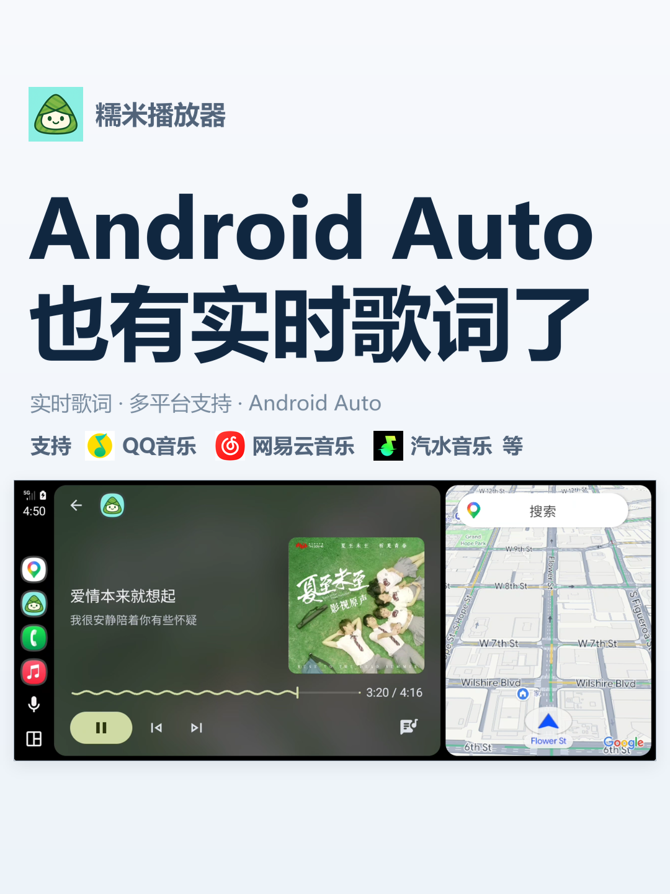
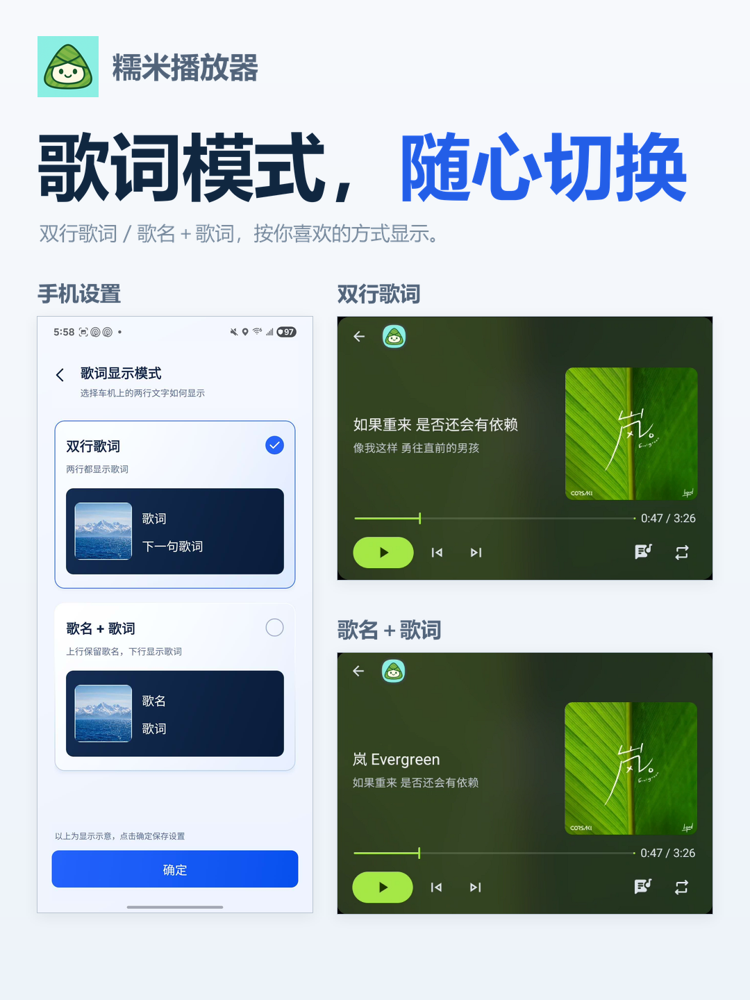
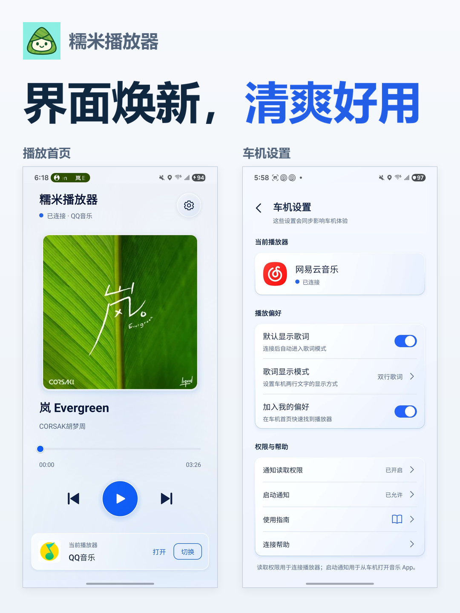
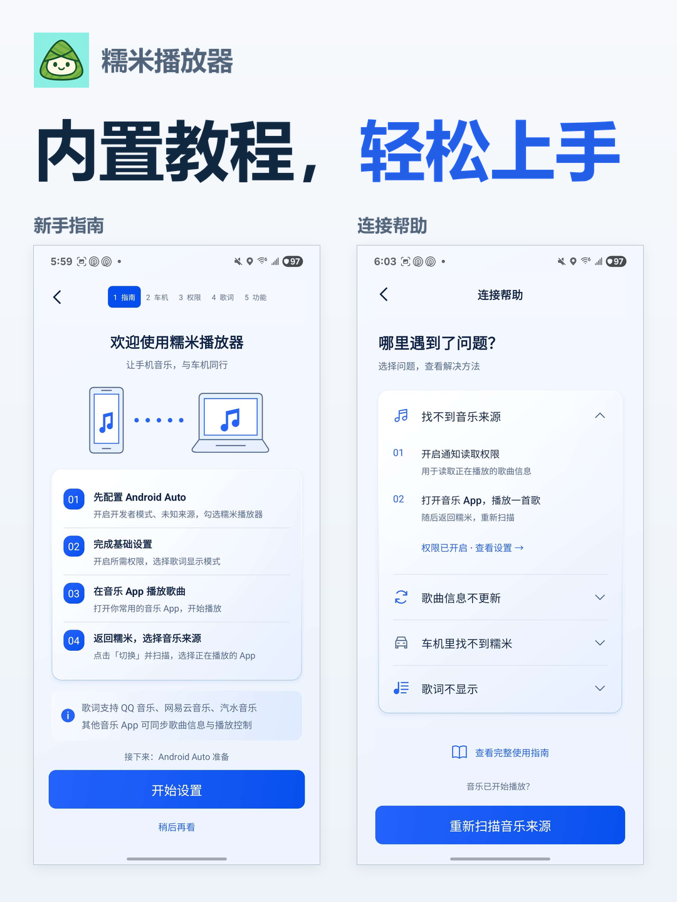

  <a href="./README.zh-CN.md">中文</a> | <b>English</b>

# NuomiPlayer · An Android Auto music companion

**Bring the music apps you already use along for the ride.**

NuomiPlayer mirrors track information and playback controls from your phone's music apps to Android Auto. See the title, artist, artwork, progress, and time-synced lyrics from supported sources while keeping your existing player and playlists. Audio continues to play through the original music app.

> **NuomiPlayer 3.0 is available!** [Download the 3.0 APK](https://github.com/charlottejas/NuomiPlayer/releases/download/v3.0/nuomi-player-3.0-release.apk) · [Release notes](https://github.com/charlottejas/NuomiPlayer/releases/tag/v3.0). Requires **Android 13 or later** and an Android Auto-compatible setup.

[Download NuomiPlayer 3.0](https://github.com/charlottejas/NuomiPlayer/releases/download/v3.0/nuomi-player-3.0-release.apk) · [Versions and downloads](#versions-and-downloads) · [Getting started](#getting-started) · [Report an issue](https://github.com/charlottejas/NuomiPlayer/issues)

## Meet NuomiPlayer 3.0

The images below use Chinese captions. Select an image to view it at full size.

<table>
  <tr>
    <td></td>
    <td></td>
  </tr>
  <tr>
    <td></td>
    <td></td>
  </tr>
</table>

## What's new in 3.0

- **Time-synced lyrics, now including Qishui Music.** Adds Qishui/Luna lyrics alongside QQ Music and NetEase Cloud Music. Availability depends on the track, source, and network.
- **Two lyric layouts.** Choose the current and next lyric lines, or keep the track title above the current lyric. Preview the layout on your phone and confirm to save. Enable lyrics by default or toggle them from the car screen.
- **A refreshed phone interface.** Redesigned player, source picker, and car settings, with prominent artwork and clearer connection, player, permission, and preference controls.
- **Music sources and favorites.** Scan and select active players on your phone, or find them under Favorites and Currently Available in the car. Save frequently used sources and initiate opening a music app from Android Auto.
- **Built-in onboarding.** Five steps cover the workflow, Android Auto setup, permissions, lyrics, and preferences. Reopen the guide whenever needed.
- **Connection troubleshooting.** Guided checks and settings links for missing sources, stale track information, a missing Android Auto entry, and missing lyrics.
- **Connection and track-transition improvements.** Refines recovery after normal background process reclamation, player-session changes, playback-state synchronization, artwork flicker and mismatched metadata, and delayed QQ lyrics or missed track updates.
- **Clearer status messages.** Distinguishes loading lyrics, unavailable lyrics, video content, and loading failures, and improves player names, unavailable-source messages, launch failures, and permission status.

## Music app compatibility

NuomiPlayer reads track information and forwards controls through Android media sessions. It can work with many music apps that expose these capabilities. **General playback compatibility does not imply universal lyric support.** The table below describes 3.0 support.

| Source | Track information and basic controls | Time-synced lyrics | Shuffle / repeat controls |
| --- | --- | --- | --- |
| QQ Music | Supported | Supported | Supported |
| NetEase Cloud Music | Supported | Supported | Supported |
| Qishui Music / Luna | Supported | Supported | Not currently provided |
| Other music apps | Depends on the app's system media capabilities | Not currently supported | Not guaranteed |

Basic controls include play, pause, previous, and next. Track information includes title, artist, artwork, and progress. Seeking depends on the source and head unit; seeking compatibility in lyric mode remains under investigation.

Your account, subscription, track availability, and audio playback remain the responsibility of the original music app. App and system updates can affect compatibility.

## Getting started

Install the [3.0 APK](https://github.com/charlottejas/NuomiPlayer/releases/download/v3.0/nuomi-player-3.0-release.apk) on a phone running Android 13 or later, then follow these steps.

1. **Configure Android Auto.** Enable developer mode and select Unknown sources in developer settings. If NuomiPlayer appears under Customize launcher, enable it and reconnect the car. See the [official Android testing documentation](https://developer.android.com/training/cars/testing).
2. **Grant notification access.** NuomiPlayer needs this permission to connect to music-app media sessions. The 3.0 guide explains permission purposes and links to system settings. Launch notifications support the flow for opening a music app from the car.
3. **Play a track in your music app first.** Return to NuomiPlayer, select Switch, scan, and choose the active source.
4. **Set your car preferences.** Choose a lyric layout, whether lyrics should appear by default, and whether the current source should be saved to Favorites.
5. **Connect and use Android Auto.** Open NuomiPlayer from the car launcher. Use the phone's guide or Connection Help if something is missing.

### Troubleshooting

| Problem | What to check |
| --- | --- |
| Music source is missing | Check notification access, play something in the original music app, and scan again. The picker lists discovered active players, not every installed app. |
| Track information is stale | Confirm the original app is playing, reselect the source, and check system background restrictions. |
| NuomiPlayer is missing in the car | Check Unknown sources and Customize launcher in Android Auto, then reconnect. |
| Lyrics are missing | Check the source, track, and lyric toggle. Online lyrics also depend on the network and upstream service. |
| Background recovery fails | System background policies can affect recovery. A deliberate Force stop is different from normal background process reclamation and requires reopening the app. |
| APK installation is restricted | Consult your phone manufacturer's official installation instructions. Android developers can also build from the repository source. |

## Versions and downloads

| Version | Availability |
| --- | --- |
| **3.0** | **Latest release:** [Download APK](https://github.com/charlottejas/NuomiPlayer/releases/download/v3.0/nuomi-player-3.0-release.apk) · [Release notes](https://github.com/charlottejas/NuomiPlayer/releases/tag/v3.0) |
| 2.0 | Previous version: [Download NuomiPlayer 2.0](https://github.com/charlottejas/NuomiPlayer/raw/main/糯米播放器2.0.apk) |

The APK is published as a Release asset. The repository source has not yet been synchronized with this 3.0 build; GitHub’s automatically generated source archives are not the corresponding 3.0 source.

Earlier versions and changelog

- [1.4.1](https://github.com/charlottejas/NuomiPlayer/raw/main/糯米播放器1.4.1.apk): Reduced permission requirements.
- [1.4.0](https://github.com/charlottejas/NuomiPlayer/raw/main/糯米播放器1.4.0.apk): Expanded from specific players to a general system-media-session approach and improved exception handling.
- [1.3.1](https://github.com/charlottejas/NuomiPlayer/raw/main/糯米播放器1.3.1.apk): Fixed opening NetEase Cloud Music.
- [1.3.0](https://github.com/charlottejas/NuomiPlayer/raw/main/糯米播放器1.3.0.apk): Added NetEase Cloud Music support.
- [1.2.0](https://github.com/charlottejas/NuomiPlayer/raw/main/糯米播放器1.2.0.apk): Added playback-mode switching and a default-lyrics option.
- [1.1.0](https://github.com/charlottejas/NuomiPlayer/raw/main/糯米播放器1.1.0.apk): Added time-synced lyrics.
- [1.0.0](https://github.com/charlottejas/NuomiPlayer/raw/main/糯米播放器%201.0.0.apk): Initial QQ Music, Android Auto, and basic playback-control support.

## Why I built it

After buying a car, I found that my usual QQ Music setup did not work directly with Android Auto, while switching players meant losing access to songs I regularly listened to. After trying other solutions, I started building NuomiPlayer to solve my own in-car listening problem.

This is a personally maintained open-source project. Feedback and contributions are welcome. If it helps you, a GitHub star is appreciated!

## Music, lyrics, and permissions

- This project is for personal learning and research. It does not include a music catalog, music-download functionality, or subscription unlocking. Audio playback is handled by the original music app.
- Track information and playback commands use Android system media mechanisms and require the appropriate notification access.
- In 3.0, QQ lyrics come from the player's media information; NetEase and Qishui lyrics are fetched online using the current track identifier.
- Rights in lyrics, artwork, and other content remain with their respective rights holders. Upstream app and service availability or rule changes can affect functionality.

## Feedback and credits

Please use [GitHub Issues](https://github.com/charlottejas/NuomiPlayer/issues) and include the NuomiPlayer version, phone model, Android version, music app and version, Android Auto/head-unit environment, and reproduction steps.

Thanks to [Booming Music](https://github.com/mardous/BoomingMusic): parts of the early phone UI were adapted from that project. Third-party code retains its own license requirements. See [LICENSE](LICENSE) for the repository's license information.
