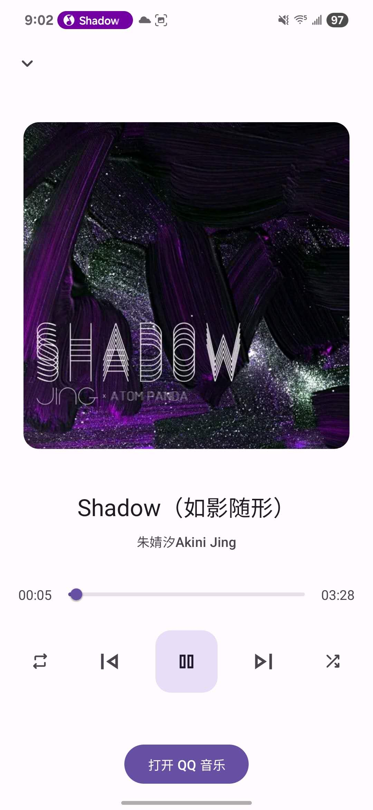

# 糯米播放器 - QQ音乐 Android Auto 支持

🚗🎶 一款支持 Android Auto 的 QQ 音乐播放扩展工具，旨在提供更优雅的车载音乐体验。  

我是在买车后才发现，自己平常使用的 QQ 音乐并不支持 Android Auto，而像 Apple Music 等支持 Android Auto 的 App 又缺少我最常听的歌曲。为了解决这个困扰，我尝试了市面上的各种解决方案，但都不尽如人意。  

其中，AnyAutoAudio 因为开发时间久远，兼容性问题较多，频繁闪退，很难稳定使用。于是我决定自己动手开发一款支持 Android Auto 的 QQ 音乐播放工具，满足自己的车载播放需求。  

由于我此前并无 Android App 开发经验，为加快开发进度，手机端播放界面部分直接使用了 Booming Music 的源代码。在此对该项目的原作者表示衷心感谢。如该使用方式不符合原项目的授权或有任何不妥，请及时与我联系，我会立即进行整改或移除。

## 📄 免责声明

本项目仅供个人学习与研究使用，**不包含任何音乐资源**，也不提供音乐服务接口。涉及 QQ 音乐 的数据仅来源于系统媒体广播，不侵犯版权。  
如项目中引用到的第三方代码存在授权问题，请联系我，我会立即删除或修改

## ✨ 项目特色

- 🚘 支持 Android Auto 播放界面展示
- 🎵 接入 QQ 音乐媒体数据（基于系统媒体广播）
- ⏩ 支持播放进度条及拖动控制
- ⏯️ 支持播放 / 暂停 / 上一首 / 下一首 控制
- 🖼️ 显示歌曲标题、艺术家、专辑图等媒体信息
- 📝 歌词同步显示

## 📸 界面预览

### 🚘 Android Auto 播放界面

### 📝 Android Auto 歌词界面

<h3>📱 手机端播放界面（使用 Booming Music 源码）</h3>

## 📥 APK 下载

你可以直接下载安装本项目构建的 APK 文件：

- 📦 [点击下载：糯米播放器 1.0.0.apk](https://github.com/charlottejas/NuomiPlayer/raw/main/糯米播放器%201.0.0.apk) 稳定版本
- 📦 [点击下载：糯米播放器 1.1.0.apk](https://github.com/charlottejas/NuomiPlayer/raw/main/糯米播放器1.1.0.apk) 增加了实时歌词

> 请确保已开启 Android Auto 的开发者模式并允许安装未知来源应用，具体步骤见下方运行指南。

## 🚀 如何运行

1. 打开 Android Auto 的开发者模式  
   可参考官方文档：[https://developer.android.com/training/cars/testing](https://developer.android.com/training/cars/testing)

2. 在 Android Auto 的开发者设置中，勾选 **“允许未知来源”**

3. 启动 Android Auto 模拟器或连接车机

4. 在手机中打开 QQ 音乐，播放任意歌曲，即可在 Android Auto 中同步控制和查看信息

> 🧪 项目默认监听系统媒体广播（如 QQ 音乐），请确保手机 QQ 音乐正在播放。

## 🛠️ 技术栈

- Java & Android SDK
- Android Auto (`automotive` 模块)
- `MediaSession` & `PlaybackStateCompat`
- BroadcastReceiver 媒体信息解析
- 自定义图标与主题色适配

## 🙏 特别鸣谢

特别感谢 [**Booming Music**](https://github.com/mardous/BoomingMusic) 项目。  
本项目手机端界面基于其源代码构建，提供了极大帮助。

